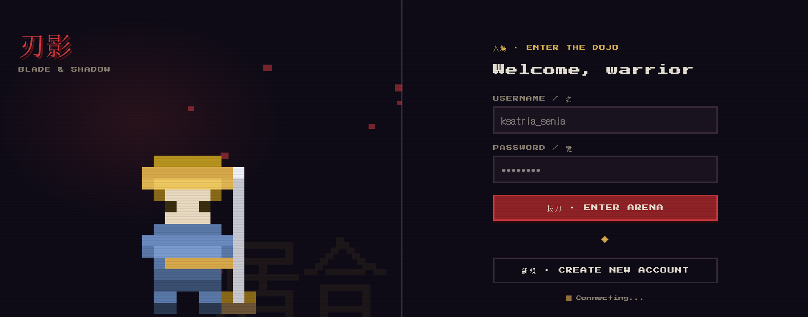
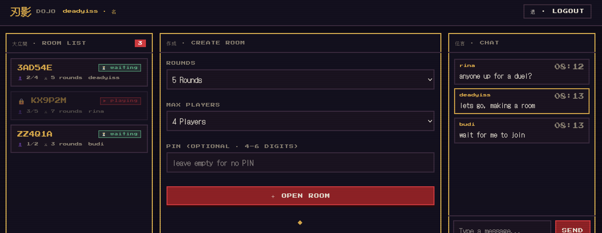
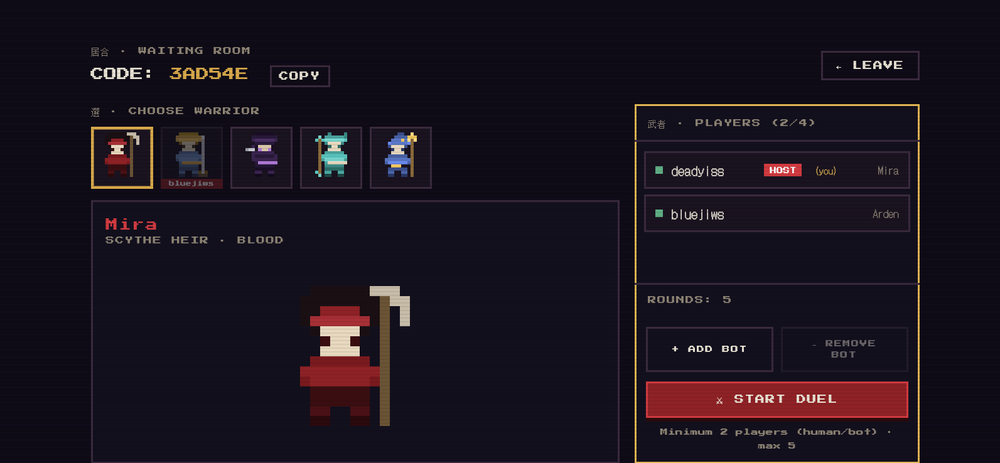
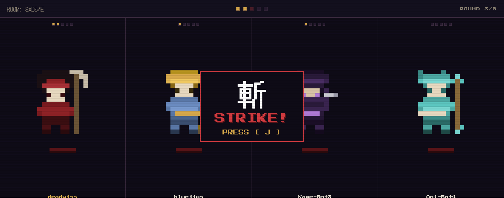
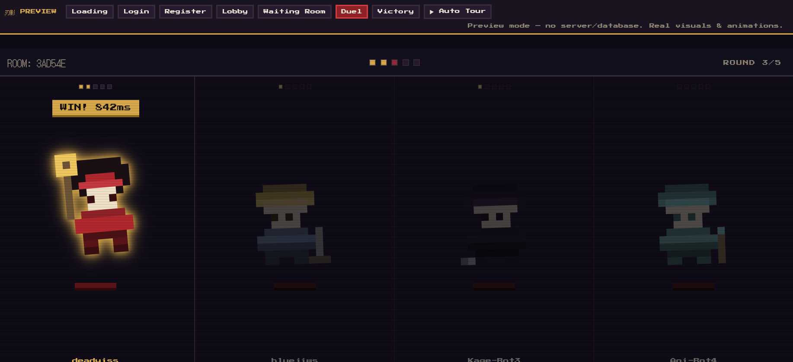
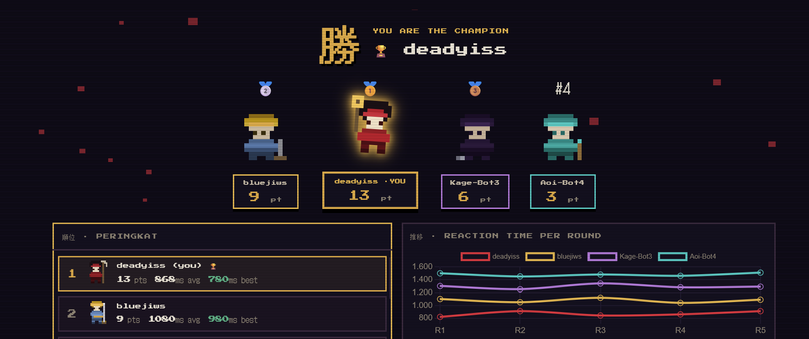

# 刃影 Reflex Showdown — Game Reaction Berbasis Web

Game duel refleks _real-time_ multiplayer berbasis web. Saat kanji **斬 (tebas)** muncul, pemain menekan tombol target secepat mungkin — yang tercepat memenangkan ronde. Dilengkapi dashboard analisis statistik yang membaca data langsung dari basis data.

**Mata Kuliah:** Cloud Computing
**Kelompok 2 — Kelas 4D**
Program Studi Teknik Informatika, Fakultas Teknologi Informasi
Universitas Islam Kalimantan Muhammad Arsyad Al-Banjari · 2026

## Preview game
Link : https://deadyiss.github.io/reflection-showdown-game/

---

## Anggota Kelompok

| Nama | NPM | Peran |
|------|-----|-------|
| Dhea Arimbi Almalita | 2410010187 | Backend |
| Muhammad Tamirul Umam | 2410010444 | Frontend |
| Norhayati | 2410010025 | Database |
| Muhammad Firja | 2410010529 | Statistik |
| Dimas Prayoga | 2410010041 | Statistik |

---

## Tautan Penting

| Dokumen | Tautan |
|---------|--------|
| Video Demo | https://example.com/demo-video _(placeholder — ganti nanti)_ |
| Proposal (PDF) | docs\pdf\Proposal_ReflexShowdown_Kelompok2.pdf |
| Laporan Akhir (PDF) | docs\pdf\Laporan_Akhir_ReflexShowdown_Kelompok2.pdf |
| Slide Presentasi (PDF) | https://example.com/slides _(placeholder — ganti nanti)_ |

---

## Teknologi yang Digunakan

- **PHP 8.1+** — server WebSocket (Ratchet + event loop ReactPHP) dan halaman statistik.
- **JavaScript (vanilla)** — sisi klien: koneksi WebSocket, kontrol UI, render arena duel. Tanpa framework.
- **MySQL** — menyimpan data pemain, sesi, ronde, dan data per klik (sumber analisis statistik).
- **WebSocket** — komunikasi real-time dua arah antara browser dan server (sinkronisasi sinyal & klik).
- **HTML & CSS** — antarmuka bertema retro pixel (font Press Start 2P, panel kotak, scanline).
- **Chart.js** — visualisasi grafik reaction time dan analisis statistik.
- **SVG pixel-art** — 5 karakter dibuat sebagai grid `<rect>` vektor (tajam pada resolusi berapa pun).

---

## Tangkapan Layar Sistem

### 1. Halaman Login


### 2. Lobi (daftar room, buat room, chat)


### 3. Ruang Tunggu & Pemilihan Karakter


### 4. Arena Duel (sinyal 斬 STRIKE)


### 5. Layar Kemenangan (podium + statistik)


### 6. Dashboard Analisis Statistik


---

## Cara Menjalankan Sistem

### Prasyarat
- Laragon (sudah termasuk PHP, MySQL/MariaDB, Composer), atau PHP 8.1+ dan MySQL terpisah.

### Langkah

1. **Install dependency**
   ```bash
   cd reflexshowdown
   composer install
   ```

2. **Buat basis data**
   Lewat HeidiSQL (bawaan Laragon): buat database bernama `reflexshowdown`, lalu **File → Load SQL file** → pilih `database/schema.sql` → jalankan (F9).

3. **Periksa konfigurasi** di `config.php` (default Laragon: user `root`, password kosong, database `reflexshowdown`).

4. **Jalankan server WebSocket** (biarkan terminal ini terbuka):
   ```bash
   php server.php
   ```
   Server berjalan di port `8080`.

5. **Jalankan frontend** (terminal kedua):
   ```bash
   cd public
   php -S localhost:3000
   ```
   Buka `http://localhost:3000` di browser.

6. **Main:** Register/Login → buat room → pilih karakter → undang teman (atau tambah bot) → Start Duel.

7. **Lihat analisis:** dari lobi klik tombol **統計 · Analytics**, atau buka `http://localhost:3000/analytics.php`.

> **Preview tanpa setup:** buka `preview.html` langsung di browser untuk melihat seluruh tampilan & animasi game tanpa menjalankan server atau basis data.

---

## Analisis Statistik

Halaman `analytics.php` membaca data **langsung dari basis data** (tabel `round_results`, `rounds`, `game_sessions`, `players`) — bukan data simulasi — lalu menghitung metrik dan menguji hipotesis proposal secara otomatis.

### Metrik yang Dihitung

| Metrik | Rumus |
|--------|-------|
| Reaction Time (RT) | `click_time − signal_time` (ms) |
| Rata-rata RT | `SUM(RT) / n` |
| Konsistensi (Range) | `max(RT) − min(RT)` |
| Standar Deviasi (SD) | `SQRT( SUM( (RTᵢ − rata)² ) / n )` |
| Tren Performa | `avg_RT(ronde 4–5) − avg_RT(ronde 1–2)` (negatif = membaik) |
| Win Rate | `total_wins / total_games × 100%` |
| Early Click Rate | `total_early / total_rounds × 100%` |

### Pertanyaan yang Dijawab (sesuai hipotesis proposal)

**H1 — Apakah performa pemain meningkat setelah beberapa kali bermain?**
Dashboard membandingkan rata-rata RT pada ronde awal (1–2) dengan ronde akhir (4–5) di seluruh sesi. Jika RT akhir lebih rendah, performa meningkat. Prediksi proposal: RT ronde 4–5 lebih rendah 10–20% dari ronde 1–2. Hasilnya ditampilkan dengan grafik tren dan penilaian otomatis **TERBUKTI / TIDAK TERBUKTI**.

**H2 — Apakah terdapat pemain yang lebih konsisten dibanding pemain lain?**
Dashboard menghitung Standar Deviasi RT tiap pemain (makin kecil = makin konsisten) dan korelasi Pearson antara SD dan win rate. Prediksi proposal: korelasi negatif (SD rendah → win rate tinggi). Ditampilkan sebagai scatter plot beserta koefisien korelasi, dengan penilaian otomatis.

**Apakah hipotesis pada proposal terbukti?**
Halaman menampilkan kesimpulan akhir berdasarkan data nyata yang terkumpul: status H1 dan H2 (terbukti atau tidak), beserta angka pendukung (persentase peningkatan, koefisien korelasi). Karena penilaian dihitung secara real-time dari isi basis data, kesimpulan akan menyesuaikan seiring bertambahnya data permainan.

### Kesimpulan Didukung Data
Setiap klaim pada dashboard disertai angka yang dihitung dari tabel basis data: jumlah sesi, jumlah data klik, rata-rata RT per ronde, SD per pemain, dan win rate. Tidak ada nilai yang di-_hardcode_ — halaman kosong sebelum ada permainan dan terisi otomatis setelah beberapa sesi.

> **Catatan:** untuk hasil yang bermakna, kumpulkan data dengan memainkan beberapa sesi (idealnya beberapa pemain manusia, masing-masing beberapa sesi 5 ronde). Dengan sedikit data, hipotesis mungkin tampil "tidak terbukti" hanya karena sampel kecil.

---

## Struktur Proyek

```
reflexshowdown/
├── server.php              # Entry point server WebSocket
├── config.php              # Konfigurasi DB & host/port
├── composer.json           # Dependency PHP (Ratchet, dll.)
├── preview.html            # Preview tampilan tanpa server/database
├── database/
│   └── schema.sql          # Skema 4 tabel
├── src/
│   ├── GameServer.php      # Handler pesan WebSocket & manajemen room
│   ├── Room.php            # Logika room: ronde, skor, bot, timer
│   └── DB.php              # Akses basis data (PDO)
├── docs/screenshots/       # Tangkapan layar dokumentasi
└── public/                 # Root web
    ├── index.html
    ├── analytics.php       # Dashboard analisis statistik
    ├── css/{theme,style}.css
    └── js/{config,sprites,game-canvas,fx,app}.js
```

---

## Fitur Utama

- Duel multiplayer real-time via WebSocket (server sebagai single source of truth).
- Target acak tiap ronde (tombol keyboard atau klik mouse) — menuntut refleks asli.
- 5 karakter pixel-art dengan animasi idle/menang/kalah + reservasi karakter per-room.
- Sistem bot (mode easy) — host dapat menambah bot; total pemain manusia + bot maksimal 5.
- Pengukuran reaction time akurat (diukur di sisi klien, bebas latency jaringan).
- Statistik akhir: podium, peringkat, grafik RT per ronde.
- Dashboard analisis statistik berbasis data basis data (`analytics.php`).
- Chat lobi, room ber-PIN, reconnect otomatis.

---

## Aturan Permainan

| Posisi | Poin |
|--------|------|
| Tercepat (rank 1) | +3 |
| Rank 2 | +2 |
| Rank 3 | +1 |
| Rank 4+ | 0 |
| **FLINCH** (klik sebelum sinyal) | **−1** dan ronde langsung berakhir |

Ronde berakhir begitu pemain pertama menekan dengan benar. Pemain yang tidak bereaksi tepat waktu dianggap tidak merespons (0 poin pada ronde itu).

---

_Proyek tugas Mata Kuliah Cloud Computing — Kelompok 2 Kelas 4D, Teknik Informatika, UNISKA, 2026._