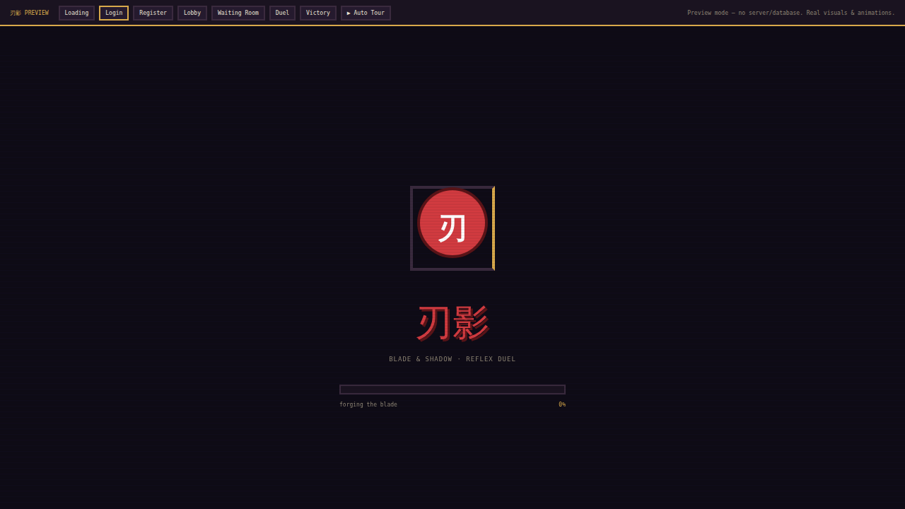
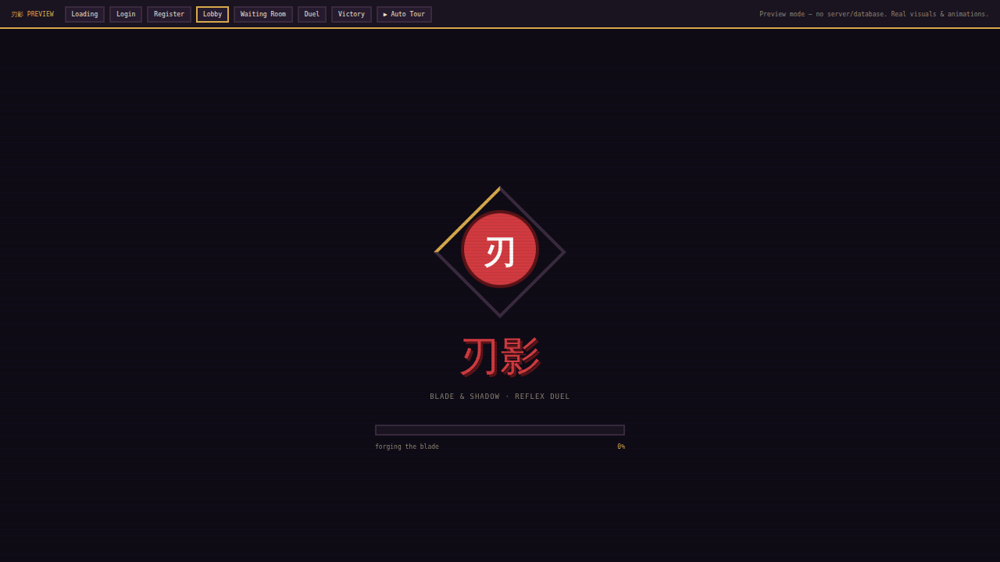
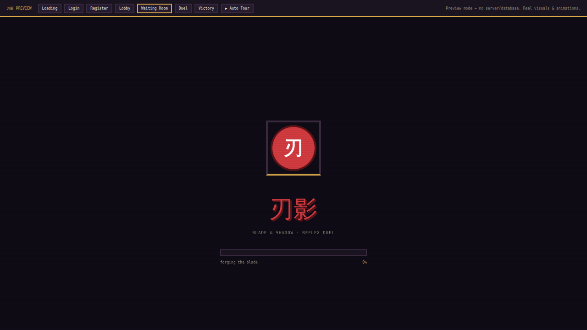
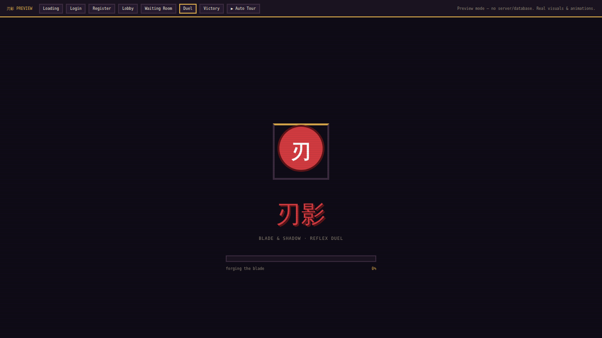
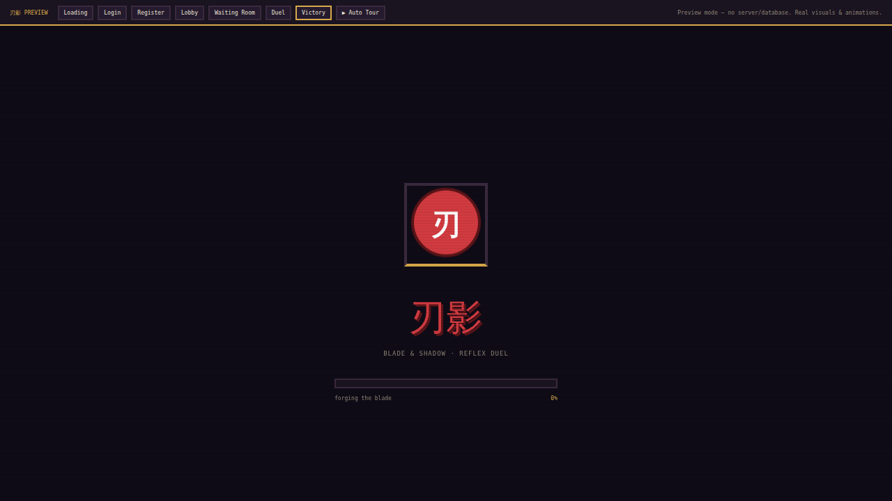
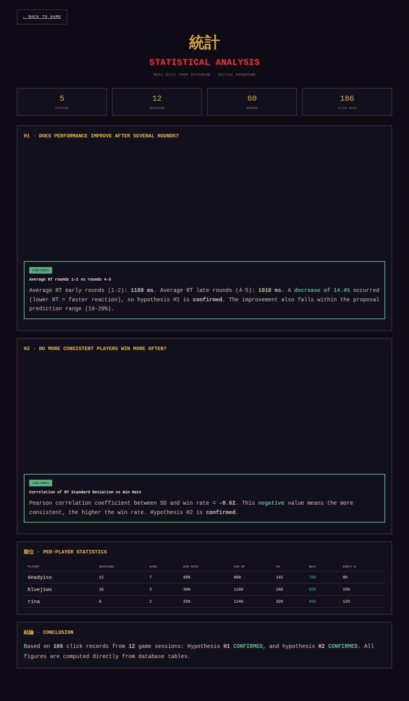

# 刃影 Reflex Showdown — Web-Based Reaction Game

A real-time multiplayer reflex duel game for the web. When the kanji **斬 (strike)** appears, players press the target key as fast as possible — the fastest wins the round. Includes a statistical analysis dashboard that reads data directly from the database.

**Course:** Cloud Computing
**Group 2 — Class 4D**
Informatics Engineering Study Program, Faculty of Information Technology
Universitas Islam Kalimantan Muhammad Arsyad Al-Banjari · 2026

---

## Group Members

| Name | Student ID (NPM) | Role |
|------|------------------|------|
| Dhea Arimbi Almalita | 2410010187 | Backend |
| Muhammad Tamirul Umam | 2410010444 | Frontend |
| Norhayati | 2410010025 | Database |
| Muhammad Firja | 2410010529 | Statistics |
| Dimas Prayoga | 2410010041 | Statistics |

---

## Important Links

| Document | Link |
|----------|------|
| Demo Video | https://example.com/demo-video _(placeholder — replace later)_ |
| Proposal (PDF) | https://example.com/proposal _(placeholder — replace later)_ |
| Final Report (PDF) | https://example.com/final-report _(placeholder — replace later)_ |
| Presentation Slides (PDF) | https://example.com/slides _(placeholder — replace later)_ |

> Replace the placeholder links above with your actual Google Drive / YouTube links.

---

## Technologies Used

- **PHP 8.1+** — WebSocket server (Ratchet + ReactPHP event loop) and the statistics page.
- **JavaScript (vanilla)** — client side: WebSocket connection, UI control, duel arena rendering. No framework.
- **MySQL** — stores player, session, round, and per-click data (the source for statistical analysis).
- **WebSocket** — real-time two-way communication between browser and server (signal & click sync).
- **HTML & CSS** — retro pixel-themed interface (Press Start 2P font, blocky panels, scanlines).
- **Chart.js** — visualization of reaction-time graphs and statistical analysis.
- **SVG pixel-art** — 5 characters built as `<rect>` vector grids (sharp at any resolution).

---

## System Screenshots

### 1. Login Page


### 2. Lobby (room list, create room, chat)


### 3. Waiting Room & Character Selection


### 4. Duel Arena (斬 STRIKE signal)


### 5. Victory Screen (podium + statistics)


### 6. Statistical Analysis Dashboard


---

## How to Run the System

### Prerequisites
- Laragon (includes PHP, MySQL/MariaDB, Composer), or PHP 8.1+ and MySQL separately.

### Steps

1. **Install dependencies**
   ```bash
   cd reflexshowdown
   composer install
   ```

2. **Create the database**
   Using HeidiSQL (bundled with Laragon): create a database named `reflexshowdown`, then **File → Load SQL file** → choose `database/schema.sql` → run (F9).

3. **Check configuration** in `config.php` (Laragon defaults: user `root`, empty password, database `reflexshowdown`).

4. **Run the WebSocket server** (keep this terminal open):
   ```bash
   php server.php
   ```
   The server runs on port `8080`.

5. **Run the frontend** (second terminal):
   ```bash
   cd public
   php -S localhost:3000
   ```
   Open `http://localhost:3000` in your browser.

6. **Play:** Register/Login → create a room → choose a character → invite friends (or add bots) → Start Duel.

7. **View analysis:** from the lobby click the **統計 · Analytics** button, or open `http://localhost:3000/analytics.php`.

> **Preview without setup:** open `preview.html` directly in a browser to see the entire UI & animations without running the server or database.

---

## Statistical Analysis

The `analytics.php` page reads data **directly from the database** (tables `round_results`, `rounds`, `game_sessions`, `players`) — not simulated data — then computes metrics and tests the proposal's hypotheses automatically.

### Computed Metrics

| Metric | Formula |
|--------|---------|
| Reaction Time (RT) | `click_time − signal_time` (ms) |
| Average RT | `SUM(RT) / n` |
| Consistency (Range) | `max(RT) − min(RT)` |
| Standard Deviation (SD) | `SQRT( SUM( (RTᵢ − avg)² ) / n )` |
| Performance Trend | `avg_RT(rounds 4–5) − avg_RT(rounds 1–2)` (negative = improving) |
| Win Rate | `total_wins / total_games × 100%` |
| Early Click Rate | `total_early / total_rounds × 100%` |

### Questions Answered (per the proposal hypotheses)

**H1 — Does player performance improve after playing several times?**
The dashboard compares average RT in early rounds (1–2) with late rounds (4–5) across all sessions. If late RT is lower, performance improved. Proposal prediction: rounds 4–5 RT is 10–20% lower than rounds 1–2. The result is shown with a trend graph and an automatic **CONFIRMED / NOT CONFIRMED** verdict.

**H2 — Are some players more consistent than others?**
The dashboard computes each player's RT Standard Deviation (smaller = more consistent) and the Pearson correlation between SD and win rate. Proposal prediction: a negative correlation (low SD → high win rate). Shown as a scatter plot plus the correlation coefficient, with an automatic verdict.

**Are the proposal's hypotheses confirmed?**
The page shows a final conclusion based on the real data collected: the status of H1 and H2 (confirmed or not), along with supporting figures (improvement percentage, correlation coefficient). Because the verdict is computed in real time from the database contents, the conclusion updates as more game data accumulates.

### Conclusions Supported by Data
Every claim on the dashboard is backed by a figure computed from the database tables: number of sessions, number of click records, average RT per round, per-player SD, and win rate. No value is hard-coded — the page is empty before any games are played and fills in automatically after a few sessions.

> **Note:** for meaningful results, collect data by playing several sessions (ideally multiple human players, each across several 5-round sessions). With little data, hypotheses may show "not confirmed" simply due to a small sample.

---

## Project Structure

```
reflexshowdown/
├── server.php              # WebSocket server entry point
├── config.php              # DB & host/port configuration
├── composer.json           # PHP dependencies (Ratchet, etc.)
├── preview.html            # UI preview without server/database
├── database/
│   └── schema.sql          # 4-table schema
├── src/
│   ├── GameServer.php      # WebSocket message handler & room management
│   ├── Room.php            # Room logic: rounds, scoring, bots, timers
│   └── DB.php              # Database access (PDO)
├── docs/screenshots/       # Documentation screenshots
└── public/                 # Web root
    ├── index.html
    ├── analytics.php       # Statistical analysis dashboard
    ├── css/{theme,style}.css
    └── js/{config,sprites,game-canvas,fx,app}.js
```

---

## Key Features

- Real-time multiplayer duels via WebSocket (server as the single source of truth).
- Random target each round (keyboard key or mouse click) — demands genuine reflexes.
- 5 pixel-art characters with idle/win/lose animations + per-room character reservation.
- Bot system (easy mode) — the host can add bots; total human + bot players is capped at 5.
- Accurate reaction-time measurement (measured client-side, free of network latency).
- End-of-game statistics: podium, ranking, per-round RT graph.
- Database-driven statistical analysis dashboard (`analytics.php`).
- Lobby chat, PIN-protected rooms, automatic reconnect.

---

## Game Rules

| Position | Points |
|----------|--------|
| Fastest (rank 1) | +3 |
| Rank 2 | +2 |
| Rank 3 | +1 |
| Rank 4+ | 0 |
| **FLINCH** (click before the signal) | **−1** and the round ends immediately |

The round ends as soon as the first player presses correctly. Players who did not react in time are treated as non-responding (0 points that round).

---

_Coursework project for Cloud Computing — Group 2 Class 4D, Informatics Engineering, UNISKA, 2026._
